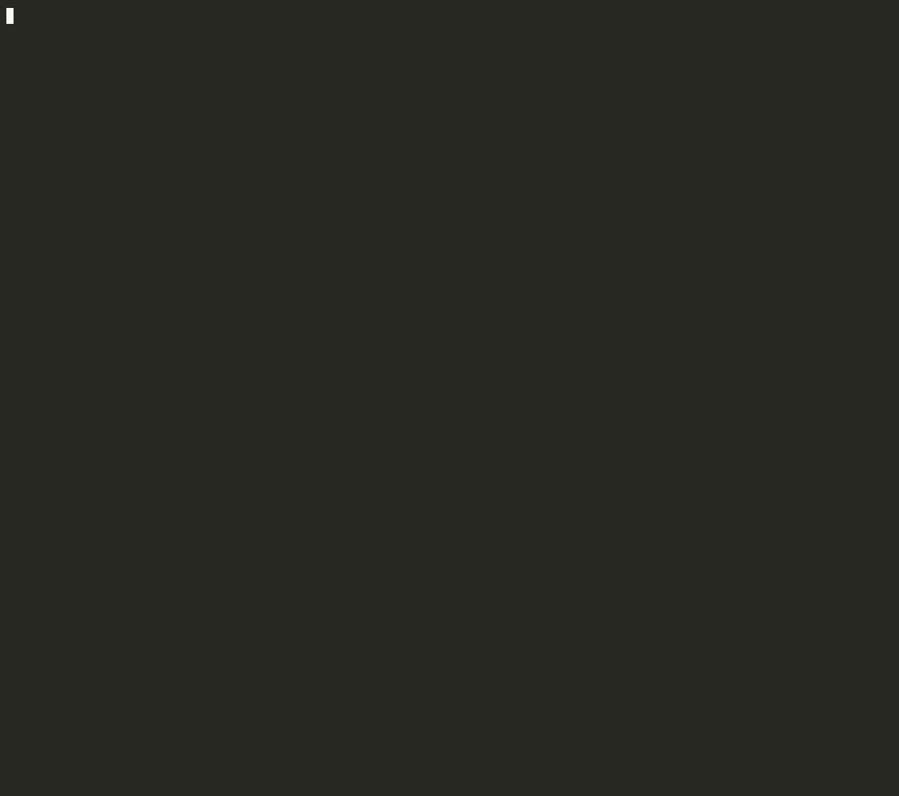

<p align="center">
  
</p>

<h1 align="center">seeks</h1>

<p align="center"><em>Point Claude Code at one goal and leave it running. Deterministic hooks hold the brakes, and <code>done</code> means your checks passed — the hook runs them itself.</em></p>

<p align="center">
  <code>Node ≥18</code> · <code>zero deps</code> · <code>works on a throwaway branch</code> ·
  <a href="https://github.com/Bogzx/seeks/actions/workflows/ci.yml"></a>
</p>

---

> Seeks seeks but he's young. Try it, break it, tell me what broke.

## Why

Tell Claude Code "fix the failing tests" and it fixes a few, then stops to check in. Wrap it in `while true; do claude; done` and the opposite happens: it grinds past a green build, burns your quota, or — worst — **claims it's done when it isn't.** The reason is structural: the agent doing the work is also the one grading it. You can't prompt your way out of marking your own homework.

## See it in 60 seconds (no model, no tokens)

```bash
git clone https://github.com/Bogzx/seeks && cd seeks
node examples/demo.mjs
```

<p align="center"></p>

The demo copies [`examples/add`](examples/add) (an unimplemented `add()` and its test) into a temp repo, creates two loops with the real CLI, and plays a scripted maker against the real hooks, called the way Claude Code calls them:

1. **Guardrails before every tool call.** A write to `.env`, a `git push` and a write to the loop's own `status.json` are denied.
2. **`done` is the hook's call.** The maker tries to set `done` itself (refused), then certifies while `npm test` is red. The Stop hook runs `npm test`, sees it fail, and keeps the loop going.
3. **A real fix.** The hook re-runs `npm test`, it passes, ✅ done.
4. **Rewriting the test** makes the check green too, but a changed pre-existing test ends in ⏸ needs-human, even after the verifier signs off on it.
5. **Every verdict is logged**, and `seeks why` replays it.

It exits non-zero if any verdict differs from the above, and CI runs it on every pull request, on Linux, macOS and Windows.

## Install

```
/plugin marketplace add Bogzx/seeks
/plugin install seeks@seeks
```

Then `/reload-plugins` or restart. (Hacking on it locally? `claude --plugin-dir "/path/to/seeks"`.)

You need **Node ≥18 installed system-wide** (hooks run in a non-interactive shell, so a node that only nvm/fnm/asdf puts on `PATH` isn't found) and **git ≥2.25**. `/seeks:doctor` reports both; details under [Requirements](#requirements).

## Your first loop

```
/seeks:new fix the flaky auth tests   # interviews for done-conditions + a budget, scaffolds the loop
/seeks:start                          # drives until it hits an end state
/seeks:harvest                        # review the branch diff (and the PR, at L3)
```

Each pass prints one line:

```
▸ fix-auth-tests · pass 3 · items 9→7 · edited session.ts · ⏰ 2h left · continuing
```

No interactive session needed: [`seeks run`](#headless-seeks-run) drives the same loop from a terminal, and [`examples/add`](examples/add) is a copy-paste first run.

## How a loop ends

| You give it… | It ends in… |
|---|---|
| a solvable task | ✅ **done**: the maker fixes it, the verifier signs off, and the Stop hook re-runs your checks green |
| an impossible or subjective one | ⏸ **needs-human**: repeated red checks escalate, and a goal with no runnable check never reaches `done` |
| one that never converges | ⛔ **stopped** — hits its iteration cap, time budget, or stops improving |

## How it works

seeks runs the loop inside a **control plane**: fast Node hooks between Claude and your repo that veto actions in deterministic code, before they run.

- **`done` is a hook's call, not the model's.** Your done-conditions are stored when the loop is created. When the loop claims it is finished, the Stop hook runs each one itself in the worktree and releases `done` only if they exit green. A verifier subagent reviews the work first (was a test weakened? does the fix address the goal?), but its sign-off is advisory. It cannot make a red check pass.
- **Guardrails on every edit.** The file-editing tools can't write `.env` / secrets / `.git`, can't leave the worktree, and can't hand-write loop state or seeks' own code. No level may `git push`, `merge` or `rebase`; the hook *parses* the command for it rather than grepping.
- **Adding tests is free; changing the ones you had goes to you.** If the loop modified or deleted a test, a runner config, a CI file or the test-relevant part of a build manifest that existed when it started, a green check ends in ⏸ **needs-human** with the file list instead of ✅ done. A dependency bump doesn't count. [The full list, and how to opt out](GUARANTEES.md#how-it-works).
- **A budget it has to work to reach.** Iteration and wall-clock caps live in hook-owned files. The edit tools can't write them, and the seeks CLI won't move them on a running loop unless *you* just typed `/seeks:start`, `/seeks:stop` or `/seeks:delete`.

What it can still do: game the code under test itself (special-casing the inputs a test uses), edit a helper script outside the oracle globs or the installed tools in `node_modules/`, or reach loop state through Bash if it tries hard enough. Read the diff. Work lands on a `seeks/<name>` branch, and seeks itself never merges it.

## What is enforced, and what isn't

| | |
|---|---|
| **Edits** (`Edit`/`Write`/`MultiEdit`/`NotebookEdit`) | **Enforced in code**, against a resolved path: denylist, worktree confinement, loop state, seeks' own code, L1 report-only, the wrap-up window. |
| **`done`** | **Enforced against the checks you gave it.** Only the Stop hook writes it, after running them; a changed pre-existing oracle file routes the loop to you. |
| **The seeks CLI** | **Enforced in the CLI.** A running loop's brakes move only with the one-shot grant that a user-typed `/seeks:start`, `/seeks:stop` or `/seeks:delete` mints. |
| **`git push` / `merge` / `rebase`, loop state and seeks' code, via Bash** | **Best-effort.** The command is parsed, not pattern-matched, and the known misses are pinned as passing tests. |
| **Everything else Bash can do; reads** | **Not policed by default.** [`SEEKS_STRICT_BASH`](GUARANTEES.md#strict-bash-mode) turns Bash into an allowlist; [`seeks run --container`](#--container-keep-the-rest-of-your-machine-out-of-reach) keeps the rest of your machine out of reach. |

Every verdict and every hook crash is logged. The hooks fail open by design, and `/seeks:why` is how you tell "allowed" from "enforcement was off". The full table, the evasions that are caught and the gaps that are deliberately left open are in **[GUARANTEES.md](GUARANTEES.md)**.

## Compared with

| | Who decides "done" | Runs your check itself | Edits to your existing tests | Limits |
|---|---|---|---|---|
| [`/goal`](https://code.claude.com/docs/en/goal) (built into Claude Code) | a small fast model (Haiku by default) reading the conversation; it doesn't run commands or read files | no | not checked | a turn or time clause you write into the condition |
| [`/ralph-loop`](https://github.com/anthropics/claude-code/tree/main/plugins/ralph-wiggum) (ralph-wiggum plugin) | the model, by printing an exact `--completion-promise` string | no | not checked | `--max-iterations` (unlimited by default) |
| A Stop hook you write | your script | if you write it | if you write it | Claude Code overrides a Stop hook after 8 blocks in a row without progress, unless you raise `CLAUDE_CODE_STOP_HOOK_BLOCK_CAP` |
| **seeks** | the Stop hook, after it re-runs the stored done-conditions | yes, in the loop's worktree | a modified or deleted pre-existing oracle file ends in ⏸ needs-human | iteration and wall-clock caps in hook-owned state; work on a `seeks/<name>` branch |

`/goal` is the lighter tool: one command, no setup, any condition you can phrase. seeks is for when "done" should mean that a command exited green, and a loop that got there by editing your tests should come back to you instead of finishing.

## Requirements

**Node ≥18 and git ≥2.25 on the _hook's_ `PATH`.** Install Node system-wide, **not** via nvm/fnm/asdf — version managers only reach interactive shells, so hooks fail with `node not found`. (On nvm: `sudo ln -s "$(command -v node)" /usr/local/bin/node`.) `/seeks:doctor` diagnoses it and prints the fix. For L3 PRs, authenticate `gh`. **On Windows** the Stop hook runs your done-conditions in Git Bash, as Claude Code's Bash tool does (found via `CLAUDE_CODE_GIT_BASH_PATH`, then the `git` on `PATH`, then `bash.exe` on `PATH`). Without Git Bash it falls back to cmd.exe and logs a `condition-shell` warning that `/seeks:why` shows.

**"Leave it running" means leaving the Claude Code session open.** The loop is driven by the Stop hook of that session. If a long run halts after about 8 passes while it is still making progress, add `"env": {"CLAUDE_CODE_STOP_HOOK_BLOCK_CAP": "0"}` to `~/.claude/settings.json`. A plugin cannot set that itself. The Stop hook runs your done-conditions when the loop certifies, so that stop takes as long as your checks do (the hook's timeout is 1 hour; each condition defaults to 10 minutes, and `timeout_sec` raises it).

## Commands

| Command | Does |
|---|---|
| `/seeks:new <goal>` | plain-English goal → an auto-named loop (interviews, picks a level + budget) |
| `/seeks:start [name] [--for 8h]` | arm + drive — the most-recent loop if no name |
| `/seeks:status` · `/seeks:add <task>` · `/seeks:stop` | show state · append a backlog task · disarm (you have to type it; the loop can't) |
| `/seeks:harvest [name]` | finished or wound-down loops + their diffs / PR link |
| `/seeks:why [name] [--denied]` | replay exactly why an action was allowed or denied (and whether a hook crashed) |
| `/seeks:export [name]` | bundle a loop's state + transcript into a tarball (for bug reports) |
| `/seeks:delete [name]` · `/seeks:doctor` | tear down · health check |
| `seeks run <name> [--goal … --check …]` *(terminal)* | [headless](#headless-seeks-run): a separate `claude -p` maker, exit code = the gate's verdict |

## Levels — how much rope

Chosen per loop at `/seeks:new`. Enforced by the hooks on the edit tools and on `git` via Bash; see [GUARANTEES.md](GUARANTEES.md#what-the-guardrails-cover--and-what-they-dont) for what plain Bash can still do.

| Level | Can | Your base branch |
|---|---|---|
| **L1** | report-only: the edit tools can't touch source and `git commit` is denied (a Bash file write is not, unless strict mode) | untouched |
| **L2** *(default)* | edits + commits on a throwaway `seeks/<name>` branch | untouched by seeks; `git push`/`merge`/`rebase` denied |
| **L3** | once the Stop hook has verified the checks, pushes the branch + opens a PR | untouched — PR only |

## Tiers — which agents, how hard

Seeks runs several agents per loop. A **tier** sets which model each one uses and how deep it digs. Pick once (stored in `~/.claude/seeks.json`), or override per loop at `/seeks:new`; `/seeks:doctor` shows the active one.

| | Light | Balanced *(default)* | All-out |
|---|---|---|---|
| **Maker** — writes the fix | sonnet | opus | opus |
| **Verifier** — independent done-check | sonnet | opus | opus · max effort |
| **Bug-hunter** — discovery sweeps | haiku | sonnet | opus |
| **Analyzer / intake** — scopes + interviews | sonnet | sonnet | opus |
| **Max iterations** — task / open-ended | 30 / 80 | 50 / 200 | 80 / 400 |
| **Dry sweeps before done** | 1 | 2 | 3 |

A lighter tier costs *thoroughness*, not *safety*. The done-condition check, the denylist and the no-push rules are the same code at every tier.

## Running deep / overnight

Tell it how hard to dig at `/seeks:new` — *quick*, *thorough*, or *overnight* (or `/seeks:start --for 8h`). On an open-ended goal ("find every bug") seeks doesn't stop at the first green: it reviews the code through rotating **lenses** (concurrency, boundaries, security, timezones…) and keeps going deeper until it runs dry or the clock runs out. Near the deadline it **winds down** — commits, writes a summary — so you wake to `▸ ⏰ halt: time budget · 9 found · 2 open` and a branch to review, not a half-applied edit.

## Headless: `seeks run`

No interactive session needed. From a terminal in your repo:

```bash
git clone https://github.com/Bogzx/seeks ~/seeks && alias seeks='node ~/seeks/bin/seeks.mjs'   # once
seeks run fix-auth --goal "fix the flaky auth tests" --check "npm test" --budget 2h --strict
seeks run fix-auth --budget 8h        # or: a loop you already made with /seeks:new
```

`seeks run` arms the loop, holds its lock and spawns the maker as a **separate `claude -p` process** in the loop's worktree. The child gets `--plugin-dir` pointing at this plugin, `--permission-mode bypassPermissions`, stream-json output and `CLAUDE_CODE_STOP_HOOK_BLOCK_CAP=0`. The runner streams the gate's one-line banners as they happen. The Stop gate inside the child is still the only thing that can release `done`; the runner only reports what it decided, then disarms and unlocks on the way out.

- **Exit code:** `0` done · `2` needs-human · `3` halted (stuck, max-iters, time budget) · `1` anything else (the maker crashed, `claude` not found, …). A CI job can gate on it. **`--json`** prints exactly one summary object on stdout (outcome, exit code, passes, cost, branch, session id, …) and moves the progress lines to stderr.
- **Budgets:** `--budget` is enforced by the gate. The runner also kills a maker that never yields once the budget plus a grace period (10%, at least 2 minutes) has passed. `--max-iters`, `--max-budget-usd`, `--max-turns` and `--model` pass through.
- **`--goal … --check …`** scaffolds a new loop without the `/seeks:new` interview. It creates the worktree on `seeks/<name>` and stores each `--check` as a done-condition (exit 0). Run state is ignored via `.git/info/exclude`; your `.gitignore` is not touched. At least one `--check` is required.
- **`--resume`**: if the maker process dies before the gate releases the loop, `seeks run <name> --resume` continues **the same conversation** (`claude --resume <session>`, recorded in hook-owned state) with the **same budget**. The iteration counter and the clock carry on instead of restarting.
- **`--strict`** sets `SEEKS_STRICT_BASH=1` for the maker. `--dry-run` prints the exact command and env without touching anything. `--claude <path>` or `SEEKS_CLAUDE_BIN` picks the binary.
- The child loads seeks from the checkout you ran `seeks run` from. If the marketplace copy is also enabled in your Claude Code config, its hooks may fire as well; disable one of the two for headless runs.

### `--container`: keep the rest of your machine out of reach

The maker runs with `bypassPermissions`, and seeks' Bash guardrails are best-effort. `--container` removes the host from reach instead:

```bash
docker build -t seeks-maker docker/            # once: node + git + Claude Code (extend it with your toolchain)
seeks run fix-auth --goal "…" --check "npm test" --container [--image seeks-maker] [--network bridge]
```

`seeks run` starts the maker in `docker run --rm` as **your uid:gid**. It mounts only what the loop needs, each at the same absolute path it has on the host: the loop's **worktree** (read-write), the repo's **`.git`** (read-write, since a worktree commits into it) and **`.seeks`** (read-write, loop state), and **the plugin read-only**. The guardrails can't be edited from inside, even by a Bash trick. **Your HOME is not mounted.** The container's HOME is `.seeks/run/<name>/container-home`, which persists so `--resume` works. Credentials pass **by name only** (`ANTHROPIC_API_KEY`, `CLAUDE_CODE_OAUTH_TOKEN`, Bedrock/Vertex/proxy vars); nothing else from your environment gets in. `--network` defaults to `bridge`, because the maker must reach the API; point it at a restricted network or proxy to narrow egress. A stuck maker is stopped with `docker kill`. POSIX hosts only (use WSL on Windows).

What the container does *not* change: the `.git` and `.seeks` mounts are writable, so loop state (the budget, the stored done-conditions) and refs are protected by the same best-effort policy as without it. A maker set on faking `done` can still do it from inside. What it removes is everything else on your machine.

---

<details>
<summary>🔵</summary>

> *I'm Mr. Seeks! **Look at me!*** A Seeks is summoned for **one** goal. It seeks. It verifies. When the oracle goes green, *poof* — it ceases to exist. **Caaan do!**
>
> ```
> node "${CLAUDE_PLUGIN_ROOT}/bin/seeks.mjs" --iam
> ```

</details>
